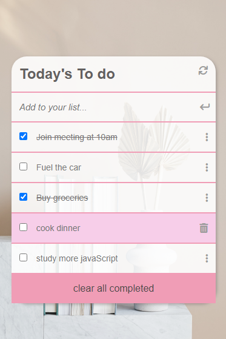

# TO-DO-LIST

> TO-DO-LIST is a tool that helps to organize your day. It simply lists the things that you need to do and allows you to mark them as complete. Here is a simple website that allows for doing that.
> "Refractor to use the webpack setup exercise to bundle JavaScript in a to-do-list application"

## Screenshots




## Live Demo

[link to live demo](https://favourezeugwa.github.io/TO-DO-LIST/dist/)

## Built With

- Webpack, and served by a Webpack dev server
- JavaScript(ES6)
- HTML
- CSS

## Getting Started

### Clone this repository

```bash
$ git clone git@github.com:Favourezeugwa/TO-DO-LIST.git
$ cd TO-DO-LIST
```

### Run project

```bash
$ npm install
$ npm run build
$ npm run start # this will enable webpack to watch for your changes in code
```

### Open page in browser

```bash
$ open dist/index.html
```

## Author

👤 **Favour Amarachi Ezeugwa**

- GitHub: [@Favourezeugwa](https://github.com/Favourezeugwa)
- LinkedIn: [Favour Amarachi Ezeugwa](https://www.linkedin.com/in/favour-amarachi-ezeugwa-a5bb31149/)

## Collaborator

👤 **Abdelruhman Mihamed**

- GitHub: [@Abdo9826](https://github.com/Abdo9826)
- LinkedIn: [Abdelruhman Mihamed](https://www.linkedin.com/in/abdelruhman-mihamed-a42667179/)

## 🤝 Contributing

Contributions, issues, and feature requests are welcome!

## Show your support

Give a ⭐️ if you like this project!

## Acknowledgments

- Hat tip to anyone who's code/resource was used
- Inspiration
- Microverse student community

## 📝 License

This project is [MIT](./MIT.md) licensed.
